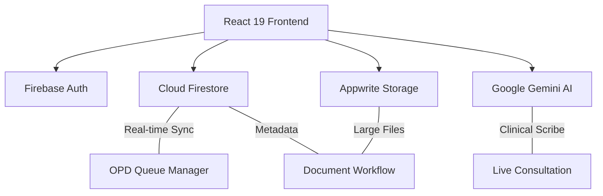

# 🏥 DocPilot: Next-Generation AI-Powered Medical Suite

[](https://reactjs.org/)
[](https://www.typescriptlang.org/)
[](https://tailwindcss.com/)
[](https://firebase.google.com/)
[](https://appwrite.io/)
[](https://deepmind.google/technologies/gemini/)

**DocPilot** is a sophisticated, data-driven healthcare platform designed for high-performance clinical practice management. Engineered with a multi-tenant architecture, it bridges the gap between patient care and operational efficiency using real-time synchronization, intelligent automation, and hybrid storage solutions.

---

## 🏗️ System Architecture

DocPilot utilizes a hybrid cloud architecture for maximum reliability and regulatory compliance:



### Core Architecture Components:
- **Authentication**: Firebase Auth with Role-Based Access Control (RBAC).
- **Primary Database**: Cloud Firestore for real-time state, appointment queues, and messaging.
- **Hybrid Storage**: Firestore handles clinical metadata while Appwrite Storage manages secure, large-scale medical imaging (DICOM/JPG) and reports.
- **Intelligence Layer**: Google Gemini API integrated for real-time clinical note generation and diagnostic support.

---

## 🔥 Deep-Dive: Key Features

### 📅 Real-time OPD Queue Manager (`src/pages/OPDManager.tsx`)
A live-syncing outpatient department interface with sophisticated queueing logic:
- **Dynamic Wait Tracker**: Automatically calculates average wait times based on live patient density (e.g., `WaitingCount * 12m`).
- **Priority Triage**: Color-coded categorization (`High`, `Medium`, `Low`) to identify critical cases instantly.
- **Live Sync**: Uses Firestore `onSnapshot` for zero-latency updates to the medical lobby.

### 🎥 AI-Driven Telehealth (`src/pages/DoctorLiveConsultation.tsx`)
A high-fidelity virtual consultation room:
- **AI Clinical Scribe**: Listen-mode integration that generates SOAP (Subjective, Objective, Assessment, Plan) notes in real-time.
- **Integrated Transcription**: Live visual feedback of patient-doctor dialogue.
- **Smart Recs**: AI-flagged contraindications and suggested diagnostic pathways during the session.

### 📁 Hybrid Document Workflow (`src/pages/DocumentWorkflow.tsx`)
Comprehensive EHR management system:
- **Dual Flow**: Supports both "Handwritten Prescriptions" (scanned uploads via Appwrite) and "Online Prescriptions" (structured data schemas).
- **Specialized Viewer**: Integrated support for clinical imaging and PDF reports with secure session-based URLs.
- **Patient Mapping**: Intelligent lookups of patient metadata across fragmented medical records.

### 📊 Clinical Analytics (`src/pages/AnalyticsPage.tsx`)
Data-driven practice performance monitoring:
- **Practice Volume**: Visualizing appointment vs. consultation trends using Recharts.
- **Severity Indexing**: Distribution analysis of patient priority levels.
- **Automated Reporting**: Exportable daily practice reports (PDF/TXT).

---

## 🔒 Security Model

Security is not a feature; it is the foundation:
- **Firestore Rules (`firestore.rules`)**: Granular resource-level security ensuring doctors only access their assigned patients and patients only access their own records.
- **RBAC Validation**: Server-side validation of user roles (`doctor`/`patient`) for every database transaction.
- **HIPAA Readiness**: End-to-end encryption for sensitive health data and secure isolated storage buckets.

---

## 🛠️ Technical Specification

| Ecosystem | Technology |
| :--- | :--- |
| **Framework** | **React 19** (Concurrent Mode) |
| **Styling** | **Tailwind CSS 4** with CSS Variables |
| **Dev Tools** | **Vite 6** + **TypeScript 5.8** |
| **Animation** | **Motion** (Framer Motion) |
| **Charts** | **Recharts** (SVG based) |
| **Icons** | **Lucide React** |

---

## 🚀 Deployment & Setup

### Environment Variables
```env
VITE_FIREBASE_API_KEY=********
VITE_FIREBASE_AUTH_DOMAIN=docpilot.firebaseapp.com
VITE_FIREBASE_PROJECT_ID=docpilot
VITE_APPWRITE_ENDPOINT=https://cloud.appwrite.io/v1
VITE_APPWRITE_PROJECT_ID=********
VITE_GOOGLE_GENAI_KEY=********
```

### Quick Install
```bash
npm install
npm run dev
```

---

<p align="center">
  Built for the future of clinical medicine | ⚡ Developed by <b>Saksham</b>
</p>
