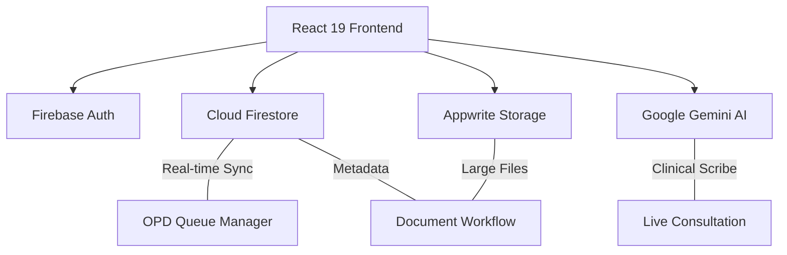

# 🏥 DocPilot: Next-Generation AI-Powered Medical Suite

[](https://reactjs.org/)
[](https://www.typescriptlang.org/)
[](https://vitejs.dev/)
[](https://tailwindcss.com/)
[](https://firebase.google.com/)
[](https://appwrite.io/)
[](https://deepmind.google/technologies/gemini/)

**DocPilot** is a sophisticated, AI-augmented clinical management platform designed for high-performance practice management. Built for two distinct user roles — **Doctors** and **Patients** — it digitalises the entire outpatient workflow: from appointment booking and OPD queue management, through live chat consultations and prescription creation, to file storage, analytics, and billing.

---

## 🏗️ System Architecture

DocPilot uses a hybrid cloud architecture for maximum reliability and regulatory compliance:



### Core Architecture Components
- **Authentication**: Firebase Auth with Role-Based Access Control (RBAC) supporting **Email/Password**, **Google OAuth**, and **GitHub OAuth** (`'doctor'` or `'patient'` role enforced at both client and database level).
- **Primary Database**: Cloud Firestore with `onSnapshot` real-time listeners throughout — zero-latency queue, notifications, and chat sync.
- **Hybrid Storage**: Firestore handles clinical metadata + online prescriptions; Appwrite Storage manages large medical files (DICOM/JPG/PDF).
- **Intelligence Layer**: Google Gemini API for AI chat assistant and clinical note generation.

---

## 📁 Project Structure

```
src/
├── App.tsx                    # Root router + ProtectedRoute RBAC guard
├── firebase.ts                # Firebase SDK (Auth, Firestore, Storage)
├── layouts/
│   ├── DashboardLayout.tsx    # Main shell: sidebar, top header, mobile nav
│   └── AuthLayout.tsx         # Auth pages wrapper
├── pages/                     # 22 page components
├── components/
│   ├── ChatWidget.tsx          # Floating Gemini AI assistant
│   └── PatientProfileModal.tsx # Doctor-side patient profile overlay
└── lib/
    ├── utils.ts                # cn(), Firestore error handler
    └── appwrite.ts             # Appwrite storage client
```

---

## 🔐 Authentication & Routing

- **Firebase Auth** — Email/Password + **Google OAuth** + **GitHub OAuth** (`GoogleAuthProvider`, `GithubAuthProvider`)
- **Automated Password Reset** — Integrated `sendPasswordResetEmail` flow with input validation
- On each load, `onAuthStateChanged` reads the user's `role` from `users/{uid}` in Firestore
- `ProtectedRoute` in `App.tsx` enforces strict role redirects — a doctor visiting a patient route is bounced to `/doctor` and vice versa

### Route Map

| Path | Role | Page |
|---|---|---|
| `/` | Public | Landing Page |
| `/login` `/signup` `/forgot-password` | Public | Auth Pages |
| `/solutions` `/features` `/about` `/pricing` etc. | Public | Marketing Pages |
| `/doctor` | Doctor | Doctor Dashboard |
| `/doctor/appointments` | Doctor | Appointment Manager |
| `/doctor/consultations` | Doctor | Chat Sessions |
| `/doctor/archive` | Doctor | Document Archive |
| `/doctor/settings` | Doctor | Profile & Settings |
| `/opd` | Doctor | OPD Queue Manager |
| `/workflow` | Doctor | Document Workflow |
| `/analytics` | Doctor | Clinical Intelligence |
| `/patient` | Patient | Patient Dashboard |
| `/patient/consultations` | Patient | My Chat Sessions |
| `/patient/archive` | Patient | My Medical Records |
| `/patient/settings` | Patient | Patient Profile |
| `/book` | Patient | Book Appointment |

---

## 🔥 Modules & Features

### 🖥️ Shared Shell — `DashboardLayout.tsx`
The wrapper around every authenticated page:
- **Sidebar** (desktop): role-aware nav links with active-dot indicators
- **Top Header**: 350ms-debounced global Firestore search, notification bell panel, profile avatar
- **Mobile Hamburger**: slide-out drawer with full nav + sign-out
- **Mobile Bottom Nav**: fixed tab bar for quick navigation
- Profile name, photo, and subtext (specialty / patient ID) loaded via live `onSnapshot`

---

### 👨‍⚕️ Doctor Module

#### Dashboard — `DoctorDashboard.tsx`
- **4 stat cards**: Total Patients, Appointments, Chat Sessions, AI Insights
- **Appointment Queue**: real-time list with patient photos and status badges (In Progress / Waiting / Scheduled)
- **AI Clinical Assistant panel**: auto-derives alerts from schedule data — High Volume Day, Urgent Care, Patients Waiting, Standard Cadence — all dismissible
- **Practice Performance chart**: `BarChart` toggling weekly/monthly appointment + consultation volume (Recharts)
- **Download Report** button generates a `.txt` practice summary

#### OPD Manager — `OPDManager.tsx`
- Live patient queue with Waiting → In Progress → Completed flow
- Zero-latency updates via Firestore `onSnapshot`

#### Appointments — `DoctorAppointments.tsx`
- Full CRUD on appointments, status updates, filtering

#### Chat Sessions — `DoctorConsultations.tsx` + `DoctorLiveConsultation.tsx`
- List of scheduled/active consultations
- Live chat UI with AI-assisted note-taking / clinical scribe

#### Document Workflow — `DocumentWorkflow.tsx`
- **Upload Modal**: files sent to **Appwrite Storage** (≤ 20 MB), metadata saved in Firestore `records`
- **Create Prescription Modal**: structured digital Rx — medicine name, dosage, frequency (`X-X-X` format validated), duration
- **Prescription Viewer**: Online prescriptions rendered as formatted Rx cards; images rendered inline; PDFs in `<iframe>` via Appwrite view URL
- Stats: Pending Review / Verified Reports / Missing Information

#### Archive — `ArchivePage.tsx`
- Full history of all uploaded records across all patients, with search and category filter

#### Clinical Intelligence — `AnalyticsPage.tsx`
- **Live metrics**: Unique Patients, Total Consultations, Gross Revenue (₹), Records Filed
- **Patient Volume Area Chart**: week/month toggle
- **Specialty Distribution Pie Chart**: appointment type breakdown
- **Consultation Trends Bar Chart**: consultations + revenue over time
- Export to `.txt` report

#### Settings — `SettingsPage.tsx`
- Profile photo, bio, specialty, license number editing; security settings

---

### 🧑‍🤝‍🧑 Patient Module

#### Dashboard — `PatientDashboard.tsx`
- Upcoming appointments, recent consultations, health summary cards

#### Book Appointment — `BookAppointment.tsx`
- Browse available doctors (queried from Firestore by role)
- Select date, time slot, and consultation type (In-Person / Video Call)
- Creates `appointments` document visible to both parties instantly

#### My Chat Sessions — `PatientConsultations.tsx` + `PatientLiveConsultation.tsx`
- Lists scheduled, in-progress, and completed consultations
- Live chat interface with real-time Firestore `chats` collection messaging

#### My Medical Records — `PatientArchive.tsx`
- All prescriptions and documents shared by their doctor
- Filterable by type (Reports / Imaging); download via Appwrite URLs

#### Patient Settings — `PatientSettings.tsx`
- Name, photo, blood type, allergies, emergency contacts
- Profile photo upload to Firebase Storage; password/email change

---

### 🤖 AI Features

| Feature | Technology | Location |
|---|---|---|
| Floating AI Chat Assistant | `@google/genai` (Gemini) | `ChatWidget.tsx` |
| AI Clinical Insights | Rule-based schedule analysis | `DoctorDashboard.tsx` |
| Auto-Summarize (planned) | Gemini API | `DocumentWorkflow.tsx` |

---

## 🗄️ Firebase Data Model

| Collection | Key Fields | Access Control |
|---|---|---|
| `users` | uid, email, firstName, lastName, role, specialty, licenseNumber, patientId, bloodType, allergies, photoURL | Owner only can write; all auth users can read |
| `appointments` | doctorId, patientId, doctorName, patientName, date, time, type, status, amount | Doctor or patient party only |
| `consultations` | doctorId, patientId, date, time, status | Doctor or patient party only |
| `records` | patientId, doctorId, name, type, category, appwriteFileId, appwriteViewUrl, prescriptionData, status | Patient owner or any doctor |
| `invoices` | patientId, doctorId, amount, status (Paid/Pending/Overdue) | Owning doctor only |
| `chats` | (message documents) | Any authenticated user |

---

## 🔒 Security Model

Security is enforced at the **database level** via `firestore.rules` — not just client-side:

- `isAuthenticated()` — base guard for every operation
- `isOwner(userId)` — UID must match the document's owner field
- `isDoctor()` / `isPatient()` — role verified via **live database lookup** on every write
- Field-level schema validation on every create/update: `isValidUser()`, `isValidAppointment()`, `isValidConsultation()`, `isValidRecord()`, `isValidInvoice()`
- Single-name OAuth user compatibility (`lastName.size() >= 0`)
- **Role immutability**: `request.resource.data.role == resource.data.role` — a user cannot change their own role

---

## 🛠️ Technical Specification

| Layer | Technology |
|---|---|
| **UI Framework** | React 19 (Concurrent Mode) |
| **Language** | TypeScript 5.8 |
| **Bundler** | Vite 6 |
| **Routing** | React Router v7 |
| **Styling** | Tailwind CSS v4 + `tailwind-merge` + `clsx` |
| **Animations** | Motion (Framer Motion) v12 |
| **Charts** | Recharts v3 |
| **Icons** | Lucide React |
| **Auth + DB** | Firebase v12 (Auth, Firestore, Storage) |
| **File Storage** | Appwrite (medical documents) |
| **AI** | @google/genai (Gemini) |
| **Date Utils** | date-fns |

---

## 🚀 Setup & Deployment

### Environment Variables
```env
VITE_FIREBASE_API_KEY=********
VITE_FIREBASE_AUTH_DOMAIN=docpilot.firebaseapp.com
VITE_FIREBASE_PROJECT_ID=docpilot
VITE_APPWRITE_ENDPOINT=https://cloud.appwrite.io/v1
VITE_APPWRITE_PROJECT_ID=********
VITE_GOOGLE_GENAI_KEY=********
```

### Quick Install
```bash
npm install
npm run dev      # http://localhost:3000
npm run build    # production bundle
npm run lint     # TypeScript type check
```

---

<p align="center">
  Built for the future of clinical medicine | ⚡ Developed by <b>Saksham</b> & <b>Ayan G.</b>
</p>
