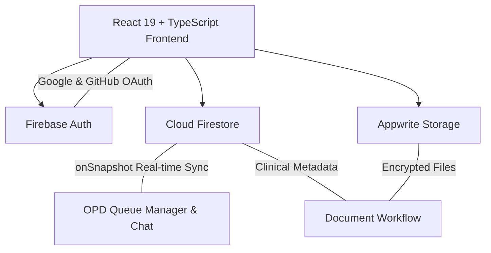

# 🏥 DocPilot: Next-Generation AI-Powered Medical Suite

[](https://reactjs.org/)
[](https://www.typescriptlang.org/)
[](https://vitejs.dev/)
[](https://tailwindcss.com/)
[](https://firebase.google.com/)
[](https://appwrite.io/)

**DocPilot** is a modern, AI-augmented clinical management suite engineered to streamline healthcare workflows. Designed for two distinct roles — **Doctors** and **Patients** — DocPilot digitalizes the full clinical lifecycle: from appointment booking and real-time OPD queue management to live consultation sessions, secure document storage, analytics, and automated password recovery.

---

## 🏗️ System Architecture

DocPilot leverages a hybrid cloud architecture for high availability, zero-latency real-time synchronization, and data confidentiality:



### Core Architecture Components
- **Authentication**: Firebase Auth with Role-Based Access Control (RBAC) supporting **Email/Password**, **Google OAuth**, and **GitHub OAuth** (`'doctor'` or `'patient'` roles).
- **Database & Sync**: Cloud Firestore utilizing real-time `onSnapshot` subscriptions for instant queue, notification, and chat synchronization.
- **Hybrid File Storage**: Appwrite Cloud Storage handles large medical documents (prescriptions, imaging, DICOMs, PDFs), while Firestore stores structured metadata.
- **Security Layer**: Granular database rules in `firestore.rules` validating data schemas (`isValidUser`, `isValidAppointment`, `isValidConsultation`, `isValidRecord`) and role immutability.

---

## 📂 Project Structure

```
docpilot/
├── src/
│   ├── App.tsx                    # Root router + ProtectedRoute RBAC guard
│   ├── firebase.ts                # Firebase SDK (Auth, Firestore, Storage)
│   ├── firebase-applet-config.json# Active Firebase project credentials
│   ├── firestore.rules            # Firestore security & validation rules
│   ├── layouts/
│   │   ├── DashboardLayout.tsx    # Responsive shell: desktop sidebar, header, mobile drawer
│   │   └── AuthLayout.tsx         # Authentication container
│   ├── pages/                     # Feature pages (Dashboards, Appointments, OPD, Archive)
│   ├── components/
│   │   ├── ChatWidget.tsx          # Real-time consultation chat widget
│   │   └── PatientProfileModal.tsx # Doctor-side patient profile overlay
│   └── lib/
│       ├── utils.ts                # Helper utilities (cn, error handlers)
│       └── appwrite.ts             # Appwrite Storage client configuration
```

---

## 🔐 Authentication & Security

- **Multi-Provider Auth**: Supports Email/Password login, Google Sign-In, GitHub Sign-In, and automated password reset emails (`sendPasswordResetEmail`).
- **Role Verification**: Enforces role isolation at login and on protected routes (`ProtectedRoute` in `App.tsx`).
- **Collision-Free Identifiers**: Generates unique, timestamped patient IDs (`P-XXXXXXYYY`).
- **Single-Name OAuth Compatibility**: Flexible name parsing supporting single-name social logins.

### Route Map

| Path | Role | Page Description |
|---|---|---|
| `/` | Public | Landing Page |
| `/login`, `/signup`, `/forgot-password` | Public | Auth & Password Recovery |
| `/solutions`, `/features`, `/pricing`, `/about` | Public | Platform Overview |
| `/doctor` | Doctor | Doctor Dashboard & Queue |
| `/doctor/appointments` | Doctor | Appointment Manager |
| `/doctor/consultations` | Doctor | Chat Consultations |
| `/doctor/archive` | Doctor | Clinical Records Archive |
| `/doctor/settings` | Doctor | Professional Profile & Settings |
| `/opd` | Doctor | Real-Time OPD Queue |
| `/workflow` | Doctor | Document & Prescription Workflow |
| `/analytics` | Doctor | Clinical Analytics & Revenue |
| `/patient` | Patient | Patient Health Dashboard |
| `/patient/consultations` | Patient | My Chat Consultations |
| `/patient/archive` | Patient | My Health Records |
| `/patient/settings` | Patient | Profile & Health Vitals |
| `/book` | Patient | Book Appointment |

---

## 🔥 Features & Highlights

### 👨‍⚕️ Doctor Portal
- **Doctor Dashboard**: Live statistics, queue overview, schedule volume alerts, and performance charts.
- **OPD Queue Manager**: Live patient tracking (Waiting → In Progress → Completed) with real-time wait-time estimators.
- **Digital Prescriptions**: Structured prescription creation tool with validated dosage schedules (`X-X-X` format) and PDF previews.
- **Appwrite Storage Integration**: Secure upload and inline preview for medical reports and imaging files up to 20MB.
- **Clinical Analytics**: Interactive revenue, appointment, and specialty distribution charts using Recharts.

### 🧑‍🤝‍🧑 Patient Portal
- **Health Dashboard**: Real-time vital signs monitoring, upcoming appointments, and consultation summaries.
- **Appointment Booking**: Browse doctors, select dates/time slots, and book in-person or video consultations.
- **Medical Archive**: Centralized access to shared prescriptions, lab reports, and uploaded documents.
- **Profile & Vitals**: Manage contact information, blood type, allergies, and emergency details.

---

## 🛠️ Tech Stack

| Layer | Technology |
|---|---|
| **Frontend Framework** | React 19 + Vite 6 |
| **Language** | TypeScript 5.8 |
| **Styling** | Tailwind CSS v3.4 + `clsx` + `tailwind-merge` |
| **Animations** | Motion (Framer Motion) |
| **Icons** | Lucide React |
| **Charts** | Recharts |
| **Authentication & Database** | Firebase v12 (Auth, Cloud Firestore) |
| **Document Storage** | Appwrite Cloud Storage SDK |
| **Routing** | React Router v7 |

---

## 🚀 Setup & Execution

### 1. Prerequisites
- **Node.js**: v18.0 or higher
- **npm**: v9.0 or higher

### 2. Installation
```bash
git clone https://github.com/saksham-dev07/Docpilot.git
cd docpilot
npm install
```

### 3. Running Locally
```bash
npm run dev      # Starts Vite dev server (default port 3000)
```

### 4. Build & Type Check
```bash
npx tsc --noEmit # Verify TypeScript types
npm run build    # Generate production build bundle
```

---

<p align="center">
  DocPilot Medical Suite | Developed by <b>Saksham</b> & <b>Ayan G.</b>
</p>
